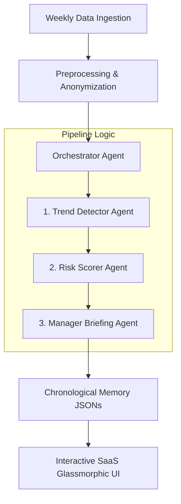

# Capstone Project: Quiet-Quitting Detector Console
## Developer and Presentation Demo Guide

This guide provides a comprehensive overview of the **Quiet-Quitting Detector Console** architecture, its multi-agent workflow logic, visual UX system, and a step-by-step walkthrough for recording demo videos and submitting the project to Kaggle/GitHub.

---

## 1. Project Overview & Objective

The **Quiet-Quitting Detector** is an advanced, enterprise-grade multi-agent diagnostics console designed to detect subtle disengagement trends in corporate workforces. By monitoring privacy-safe, non-intrusive metadata (such as task completions, after-hours logins, sick days, weekly hours, task accuracy, and communication tone/sentiment), the system identifies workers who may be sliding into burnout ("Watch"), showing indicators of active disengagement ("At Risk"), or displaying classic signs of quiet-quitting ("Silent Exit").

Unlike traditional surveillance software, the detector is **empathy-driven**. It strictly forbids disciplinary actions or surveillance suggestions. Instead, it generates highly customized, HR-safe, supportive manager briefing templates to facilitate constructive 1-on-1 conversations and workload restructuring.

---

## 2. Multi-Agent System Architecture

The core of the project relies on **four specialized agents** built with the Gemini ADK (Agent Development Kit) collaborating to produce actionable insights:



### A. The Ingestion & Preprocessing Layers ([ingestion.py](file:///d:/Antigravity/Capstone%20Project/src/data_layer/ingestion.py) & [preprocessing.py](file:///d:/Antigravity/Capstone%20Project/src/data_layer/preprocessing.py))
- **Fuzzy Alias Mapping:** Maps raw data keys from diverse sources (Postgres DB columns, AWS S3 buckets, manual uploads) to standardized keys. For example, columns like `hours_worked`, `hours`, or `weekly hours` are mapped seamlessly to `weekly_hours`.
- **Probabilistic Fallbacks:** If uploaded CSV files omit certain metrics, the preprocessing layer automatically generates realistic, probabilistic values (instead of static values) to ensure continuous logic flow without breaking the AI.
- **Strict Privacy Rule 1:** Fully strips employee last names, IDs, and usernames, preserving only first names in all prompts, responses, and session metadata.

### B. Trend Detector Agent ([trend_detector_agent.py](file:///d:/Antigravity/Capstone%20Project/src/trend_detector_agent.py))
- **Baseline Evaluation:** Programmatically compares weekly metrics against a rolling baseline of the employee's history.
- **Multi-Vector Flagging:** Detects six critical signals:
  1. *Low Activity:* Significant drop in completed tasks.
  2. *Quality Degradation:* Drop in task accuracy metrics.
  3. *Withdrawn Communication:* Drop in response tone sentiment.
  4. *Overworked / Burnout Risk:* Extended weekly working hours.
  5. *After-Hours Spikes:* Increase in night-time logins.
  6. *Absence Trends:* Elevated sick days.
- **LLM Enrichment:** Passes programmatic signals to `gemini-2.5-flash` to enrich descriptions with context and empathy before returning details to the pipeline.

### C. Risk Scorer Agent ([risk_scorer_agent.py](file:///d:/Antigravity/Capstone%20Project/src/risk_scorer_agent.py))
- **Scoring Engine:** Aggregates detected trends and assigns a risk score between **1 and 10**.
- **Classification Mapping:**
  - `Score 1-3`: **Healthy**
  - `Score 4-5`: **Watch**
  - `Score 6-7`: **At Risk**
  - `Score 8-10`: **Silent Exit**
- **Recurrence Penalties:** Adjusts the score upward if disengagement metrics are sustained over multiple consecutive weeks.

### D. Manager Briefing Agent ([manager_briefing_agent.py](file:///d:/Antigravity/Capstone%20Project/src/manager_briefing_agent.py))
- **Supportive Focus:** Generates actionable guides for managers of flagged employees.
- **Forbidden Vocabulary Guard:** Runs all output through a strict validation regex array to block punitive keywords (e.g. *disciplinary action*, *PIP*, *termination*, *surveillance*, *warning letter*), replacing any flagged outputs with an HR-safe fallback.

### E. Orchestrator Agent ([orchestrator_agent.py](file:///d:/Antigravity/Capstone%20Project/src/orchestrator_agent.py))
- **Coordination Loop:** Runs the sequential data pipeline.
- **Chronological History Builder:** Sequentially evaluates employee timelines week-by-week. It utilizes cached memory JSONs for older weeks to optimize API quota, but dynamically runs the AI evaluation for new weeks to generate authentic historical charts.
- **Synthesized Executive Summary:** Compiles individual findings into a final markdown cohort report for leadership.

---

## 3. Premium Glassmorphic Console UI/UX

The interface is built using modern front-end styling tokens designed to deliver a high-quality visual experience:
- **Obsidian Space Theme:** Utilizes rich obsidian backgrounds and custom radial ambient color glows (soft purple and light blue gradients).
- **Glassmorphism Panels:** Containers feature saturated transparency (`backdrop-filter: blur(24px) saturate(180%)`) and thin border overlays for a high-end desktop app feel.
- **Micro-interactions:** Hovering over employee lists slides the cards smoothly and adds glow shadows. Primary action buttons scale slightly when pressed.
- **Gentle SVG Pulsing:** Empty states feature slowly pulsing SVG vectors, indicating that the console is active and waiting for input.
- **Interactive Performance Log Modal:** Clicking the header API status badge opens a detailed overlay detailing live successful API counts, Jaccard similarity fallback matches, and active cascading model list routes.
- **Overhauled Briefing Card Renderer:** Evaluated manager briefings pass through an intelligent parser that removes horizontal visual dividers (`--`), renders paragraphs spacious and legible, and packages list items cleanly inside bulleted blocks without bullet character duplication.
- **Custom Scrollbars:** Replaces stock browser scrollbars with custom sleek, thin tracks to match the styling.

---

## 4. Step-by-Step Demo Walkthrough

Follow this workflow to record a demo video for Kaggle or your presentation:

### Step 1: Launch the Local Server
Start the Uvicorn application from the project directory:
```bash
uv run python -m uvicorn app:app --reload
```
Open your browser and navigate to `http://localhost:8000`.

### Step 2: Welcoming Landing Homepage
1. **Showcase the Landing Page:** Highlight the typography, the badge, the feature cards, and the randomly generated quote banners (which pull motivational/HR insights).
2. **Launch Diagnostics:** Click **"Launch Diagnostics Console"** to enter the workspace.

### Step 3: Populate Mock Registry (The Random Data Scenario)
1. **Generate Data:** Click the **"Random Data"** button in the header actions. Point out that this automatically writes randomized metrics for Weeks 1-4 for 6 distinct profiles.
2. **Review Registry Status:** Show that the list now displays all 6 employees with their Latest Week (Week 4), and their diagnostic history timeline (weeks 1-3) is pre-populated.
3. **Execute AI Diagnosis:** Click **"Evaluate Registry"**. Let it run for a couple of seconds. Once complete, click on different employees (e.g., Arjun, Priya, Karthik, Meena) to show:
   - **Engagement Index Chart:** A chronological progression showing how their risk index changed.
   - **Manager Supportive Briefing:** Empowering recommendations, safe conversation templates, and evidence-based action steps.

### Step 4: Test DB / Cloud / Prompt Ingestions
1. Go to the **"Ingest Sources"** tab in the sidebar.
2. **Natural Language extraction:** Show how you can type a natural prompt (e.g. *"Arjun had 2 sick days, 5 hours of response time, and 30 completed tasks in Week 4"*). Click **"Parse Text Observations"**.
3. Point out that the system extracts those raw values from your prompt and updates the database metrics dynamically!

### Step 5: Test the Interactive Simulator
1. Go to the **"Simulator"** tab in the sidebar.
2. Adjust the sliders (e.g., move Weekly Hours to 60, Task Accuracy to 75%, and Sentiment to "Negative") to simulate a highly burnt-out employee.
3. Click **"Run Diagnostic Simulator"** and watch the AI instantly diagnose the disengagement vectors, assign a risk score, and generate a customized action plan on the spot.

---

## 5. Submitting to Kaggle & GitHub

When publishing this capstone project, make sure to include:
1. **Source Code:** Ensure you check in all files under `src/`, `static/`, `app.py`, `pyproject.toml`, and this `CAPSTONE_DEMO_GUIDE.md`.
2. **Excluding API Keys:** Make sure your `.env` file is in `.gitignore` so your Gemini API key is never exposed publicly.
3. **Project Description:** In your Kaggle dataset or GitHub repo description, paste Section 1 and Section 2 of this guide to explain the technical innovation and agentic workflow of the detector.
