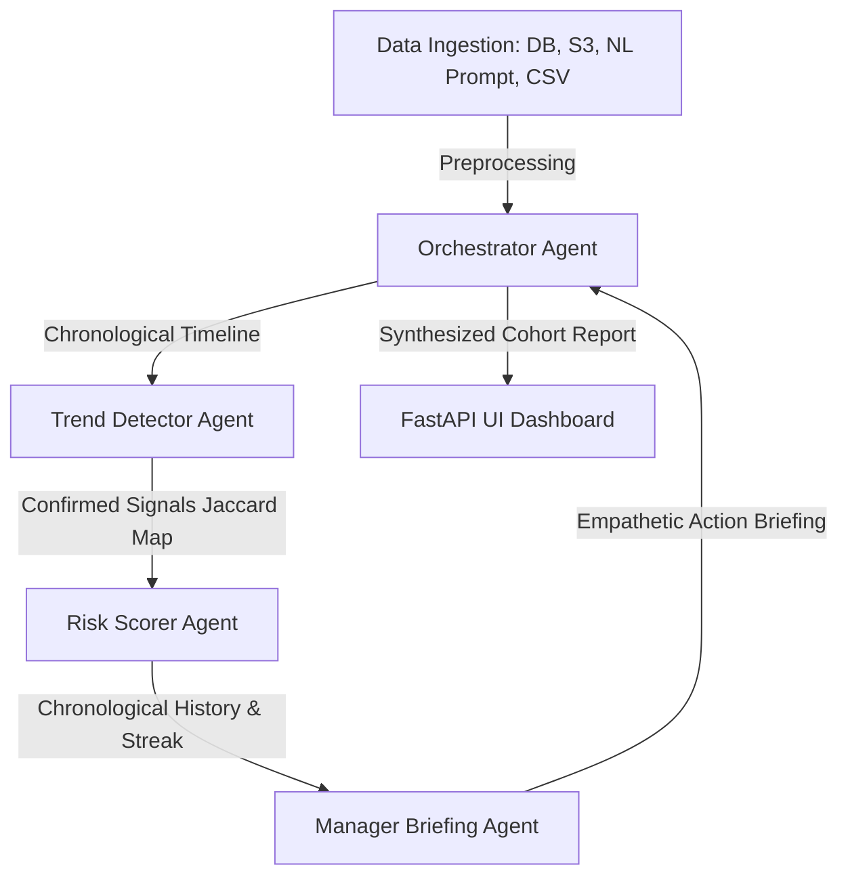

# Quiet-Quitting Detector: A Coordinated Multi-Agent Diagnostic Workspace

An advanced multi-agent system designed to evaluate chronological behavioral engagement signals, identify disengagement vectors, and synthesize supportive manager briefings, protected by a local Case-Based Reasoning (CBR) Machine Learning fallback engine and enterprise security controls.

Built with **Google's Agent Development Kit (ADK)** and **FastAPI**.

---

## 📖 Table of Contents
1. [Project Overview](#-project-overview)
2. [Multi-Agent Architecture](#-multi-agent-architecture)
3. [Key Features](#-key-features)
4. [Security & Compliance Hardening](#-security--compliance-hardening)
5. [Setup & Quick Start](#-setup--quick-start)
6. [Testing & Verification](#-testing--verification)

---

## 🔍 Project Overview
Employee disengagement and burnout represent significant financial losses for organizations due to recruiting costs, productivity deficits, and team turnover. Traditional HR evaluation relies on static yearly surveys, which fail to detect gradual disengagement trends in real time.

The **Quiet-Quitting Detector** is an interactive console that:
* Ingests weekly telemetry metrics (via Postgres database sync, AWS S3 buckets, natural text prompts, or raw CSVs).
* Separates live browser syncs and manual prompts from the core cohort database.
* Evaluates behavior chronologically against employee-specific baselines (avoiding unfair comparisons to global averages).
* Compiles supportive, HR-compliant manager briefs containing observation prompts and dialogue templates.

---

## 🤖 Multi-Agent Architecture
The system utilizes a 4-agent coordinated architecture to analyze and brief managers:



### The Coordinated Agents:
1. **Orchestrator Agent:** Validates data parity, coordinates the timeline, feeds historical states to sub-agents, and compiles the final cohort report.
2. **Trend Detector Agent:** Computes disengagement signals (e.g., declining task completion, response latency spikes, sick day anomalies) strictly against custom week-1 baselines. Confirms signals only if they persist for 2+ consecutive weeks.
3. **Risk Scorer Agent:** Evaluates active signal sets and assigns a risk index (1-10) and classification (Healthy, Watch, At Risk, Silent Exit) while incorporating a recovery-based "healthy streak" decay.
4. **Manager Briefing Agent:** Compiles HR-safe, empathetic briefing cards containing observation checklists, 3 supportive statements, and evidence-based actions.

---

## ⚡ Key Features

### 1. Dynamic API Success Caching
In environments where models frequently hit rate limits (e.g., 5 RPM limits on free tiers), sequential agent loops can suffer massive fallback latency. 
We implemented a global successful model tracker `_LAST_SUCCESSFUL_MODEL`. Once any model candidate (e.g., `gemini-1.5-flash-8b`) successfully completes an API request, the system caches it. All subsequent API queries in the execution chain prioritize this cached candidate, bypassing redundant 429 timeouts on exhausted models.

### 2. Local Machine Learning Fallback (Case-Based Reasoning)
If all external APIs fail (due to rate limits, key invalidity, or network dropouts), the system does not crash or return empty text. It executes local inference using **Case-Based Reasoning (CBR)**:
* It reads successfully evaluated JSON files from local memory (`data/memory/` and `data/realtime_memory/`) as a training pool.
* It calculates the **Jaccard Similarity** (intersection over union of active disengagement signals) between the current employee signals and past cases.
* If a similar pattern ($\ge 50\%$ match) is found, it inherits the historical classification, score, and briefing card, adding a learned marker.
* If no training records exist, it degrades gracefully to a safe default classification.

### 3. Separate Data Streams (Main vs. Real-Time)
To prevent temporary real-time metrics (like natural language prompt inputs or single DB syncs) from corrupting the core historical cohort database, the system maintains two separate file structures:
* **Main Registry:** Loads `data/weekly/*.csv` and outputs `engagement_report.txt`.
* **Real-Time Syncs:** Stores live browser inputs in `data/realtime/*.csv` and outputs `realtime_engagement_report.txt`.
The UI includes a toggle switch to flip views, run pipelines, and view briefings on either registry cohort.

---

## 🛡️ Security & Compliance Hardening
* **Stored XSS Prevention:** All output rendering nodes in the Javascript UI utilize a custom HTML escaping utility (`escapeHtml`) to prevent script injection via CSV files or natural language inputs.
* **CORS Sandboxing:** The FastAPI server replaces open wildcards with origin checks using environment-driven `ALLOW_ORIGINS`.
* **PII telemetry Masking:** Employee names are hashed using SHA-256 before generating session IDs (`session_employee_{hash}_risk`), preventing name leakage in GCP trace logs.
* **Compliance Filter:** A regex-based validator scans generated briefings and automatically swaps them for a safe fallback if punitive terms (e.g., "PIP", "disciplinary") or raw stack traces are detected.

---

## 🚀 Setup & Quick Start

### Prerequisites
* Python 3.12+
* [uv](https://docs.astral.sh/uv/) Python package manager

### Launch Instructions
1. Clone the repository:
   ```bash
   git clone https://github.com/Athish2002/quiet-quitting-detector.git
   cd quiet-quitting-detector
   ```
2. Setup local virtual environment using `uv`:
   ```bash
   uv venv
   .venv\Scripts\activate
   uv pip install -e .
   ```
3. Set your Google API key in `.env`:
   ```env
   GEMINI_API_KEY=your_key_here
   ```
4. Run the local dashboard:
   ```bash
   uv run uvicorn app:app --port 8000
   ```
5. Open your browser and navigate to `http://localhost:8000` to interact with the console.

---

## 🧪 Testing & Verification
The project includes a robust test suite covering ingestion fuzzy logic, trend thresholds, healthy streaks, and compliance filters.

Run the unit test suite to verify code compliance:
```bash
uv run pytest tests/unit
```
