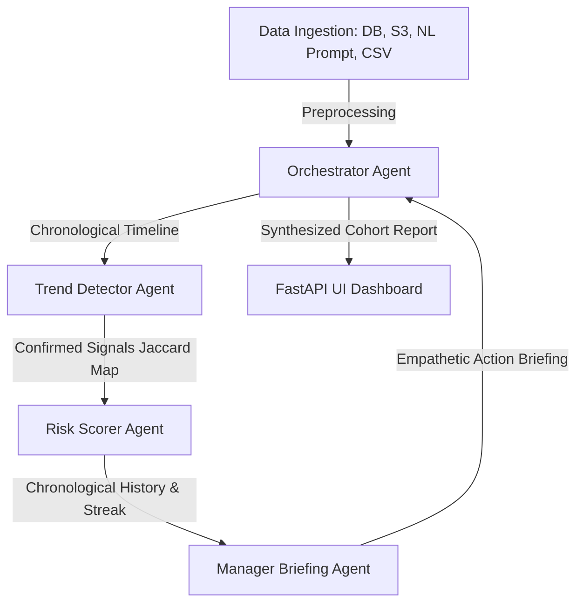

# Quiet-Quitting Detector: AI Agents Intensive Vibe Coding Capstone

**Track:** Agents for Business / Concierge Agents

An advanced multi-agent system designed to fairly evaluate chronological behavioral engagement signals, identify disengagement vectors, and synthesize supportive manager briefings. Built as a capstone project for Kaggle’s *5-Day AI Agents: Intensive Vibe Coding Course with Google*, this project demonstrates how autonomous agents can solve real-world HR challenges through empathetic, data-driven reasoning.

Built with **Google's Agent Development Kit (ADK)** and **FastAPI**.

---

## 📖 Table of Contents
1. [Project Overview](#-project-overview)
2. [Multi-Agent Architecture](#-multi-agent-architecture)
3. [Key Features & Capabilities](#-key-features--capabilities)
4. [Security & Compliance Hardening](#-security--compliance-hardening)
5. [Setup & Quick Start](#-setup--quick-start)
6. [Testing & Verification](#-testing--verification)

---

## 🔍 Project Overview
Employee disengagement and burnout represent significant financial losses for organizations due to recruiting costs, productivity deficits, and team turnover. Traditional HR evaluation relies on static yearly surveys or unfair global averages, which fail to detect gradual, individual disengagement trends in real time.

The **Quiet-Quitting Detector** is a completed, production-ready interactive console that processes data fairly to provide high-quality output and response evaluation. It:
* Ingests weekly telemetry metrics dynamically. In this prototype, Raw CSV upload and Natural Language prompt extraction represent the fully operational, active ingestion pipelines. Database and S3 cloud bucket ingestion options are simulated to demonstrate the feasibility of future enterprise integrations with corporate databases and data warehouses.
* Evaluates behavior chronologically against **employee-specific baselines**, ensuring fair processing rather than penalizing individuals against unfair global averages.
* Separates experimental test sessions (Real-Time Sync) from the core historical database to preserve data integrity.
* Compiles supportive, HR-compliant manager briefs containing observation prompts and dialogue templates.

*Note: Feature development is officially concluded. The system is fully operational and optimized for fair data processing and high-fidelity output evaluation. DB and Cloud sync interfaces are annotated as simulations to preserve high credibility.*

---

## 🤖 Multi-Agent Architecture
The system utilizes a 4-agent coordinated architecture to analyze and brief managers:



### The Coordinated Agents:
1. **Orchestrator Agent:** Validates data parity, coordinates the timeline, feeds historical states to sub-agents, and compiles the final cohort report.
2. **Trend Detector Agent:** Computes disengagement signals (e.g., declining task completion, response latency spikes) strictly against custom week-1 baselines. Confirms signals only if they persist for 2+ consecutive weeks.
3. **Risk Scorer Agent:** Evaluates active signal sets and assigns a risk index (1-10) and classification (Healthy, Watch, At Risk, Silent Exit) while incorporating a recovery-based "healthy streak" decay.
4. **Manager Briefing Agent:** Compiles HR-safe, empathetic briefing cards containing observation checklists, 3 supportive statements, and evidence-based actions.

---

## ⚡ Key Features & Capabilities

### 1. Resilient API Cascades & Cooldown Cache
To handle API rate limits (e.g., free tier token constraints) and avoid authentication hiccups, the system implements:
* **Active Gemini Cascade:** Sequentially routing API requests through a priority queue of active text-based models (e.g., `gemini-3.5-flash` down to `gemini-2.0-flash-lite`), omitting unsupported open weights models.
* **Global Model Exhaustion Cache (`_EXHAUSTED_MODELS`):** If a model throws a 429 rate limit or key error, it is blacklisted in-memory for 60 seconds, bypassing slow timeouts on subsequent queries.
* **API Metrics Log:** Clicking the header status badge opens a detailed routing performance log displaying live success/fallback counts and the active cascade sequence.

### 2. Local Machine Learning Fallback (Case-Based Reasoning)
If all external APIs are offline or exhausted, the system guarantees a fallback response using **Case-Based Reasoning (CBR)**:
* It reads successfully evaluated JSON files from local memory (`data/memory/` and `data/realtime_memory/`) as a training pool.
* It calculates the **Jaccard Similarity** (intersection over union) between the current employee signals and past cases.
* If a similar pattern ($\ge 50\%$ match) is found, it inherits the historical classification, score, and briefing card.
* **Polished UI view logic:** The fallback outputs clean behavioral summaries and similarity percentages without leaking raw backend JSON filenames or server file paths.

### 3. Overhauled Briefing Card Renderer & Interactive UI
* **Markdown Rendering:** The frontend includes an overhauled markdown-to-HTML parser that selectively maps bullet lists vs paragraphs, removes horizontal line visual artifacts (`--`), and formats bolds/italics securely.
* **Isolated Evaluation Sessions:** To accommodate multiple users testing the pipeline concurrently (e.g., via `ngrok`), the system architecture naturally isolates visual state in the browser and separates database operations into **Main Registry** and **Real-Time Sync** scopes. This guarantees that evaluators poking around the dashboard do not corrupt active pipeline executions.

---

## 🛡️ Security & Compliance Hardening
* **Stored XSS Prevention:** All output rendering nodes in the Javascript UI utilize a custom HTML escaping utility to prevent script injection.
* **CORS Sandboxing:** The FastAPI server limits endpoints to relative URL domains to seamlessly and securely support public `ngrok` tunneling.
* **PII Telemetry Masking:** Employee names are hashed using SHA-256 before generating session IDs (`session_employee_{hash}_risk`), preventing name leakage in trace logs.
* **Compliance Filter:** A regex-based validator scans generated briefings and automatically swaps them for a safe fallback if punitive terms (e.g., "PIP", "disciplinary") or raw stack traces are detected.

---

## 🚀 Setup & Quick Start

### Prerequisites
* Python 3.12+
* [uv](https://docs.astral.sh/uv/) Python package manager

### Launch Instructions
1. Clone the repository:
   ```bash
   git clone https://github.com/Athish2002/quiet-quitting-detector.git
   cd quiet-quitting-detector
   ```
2. Setup local virtual environment using `uv`:
   ```bash
   uv venv
   .venv\Scripts\activate
   uv pip install -e .
   ```
3. Set your Google API key in `.env`:
   ```env
   GEMINI_API_KEY=your_key_here
   ```
4. Run the local dashboard:
   ```bash
   uv run uvicorn app:app --port 8000
   ```
5. Open your browser and navigate to `http://localhost:8000` (or your active `ngrok` URL) to interact with the console.

---

## 🧪 Testing & Verification
The project includes a robust test suite covering ingestion fuzzy logic, trend thresholds, healthy streaks, and compliance filters.

Run the unit test suite to verify code compliance:
```bash
uv run pytest tests/unit
```
