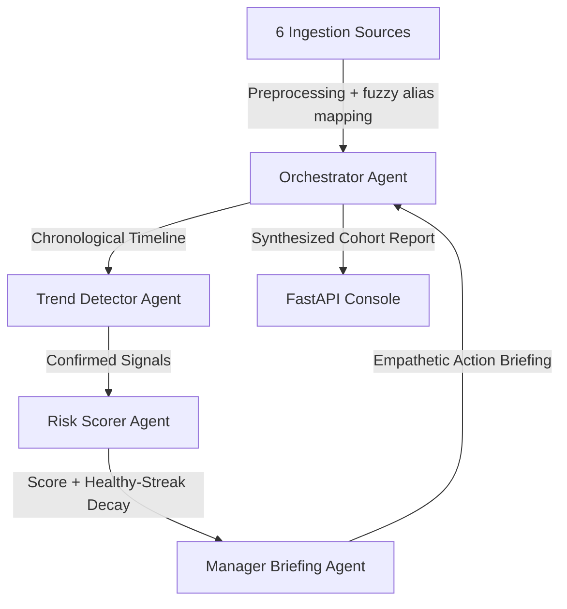

# Quiet-Quitting Detector

**An AI Agents Intensive Vibe Coding Capstone** &middot; Track: Agents for Business / Concierge Agents

A multi-agent system that fairly evaluates chronological employee engagement signals, identifies disengagement vectors, and synthesizes supportive manager briefings. Originally built for Kaggle's *5-Day AI Agents: Intensive Vibe Coding Course with Google*, it has since grown into a working local console: six ingestion paths (four fed by real data you supply; the database and cloud-bucket paths read real storage but are seeded synthetically -- see `docs/LIMITATIONS.md`), a local ML fallback that keeps the system usable when the Gemini API is rate-limited, and an audit trail of everything it does.

Built with **Google's Agent Development Kit (ADK)**, **FastAPI**, and **scikit-learn**.

---

## Table of Contents
1. [Project Overview](#project-overview)
2. [Multi-Agent Architecture](#multi-agent-architecture)
3. [Data Ingestion](#data-ingestion)
4. [Reducing API Reliance](#reducing-api-reliance)
5. [The Console UI](#the-console-ui)
6. [Security & Compliance Hardening](#security--compliance-hardening)
7. [Setup & Quick Start](#setup--quick-start)
8. [Running with Docker](#running-with-docker)
9. [Testing & Verification](#testing--verification)
10. [Contributing](#contributing)
11. [License](#license)

---

## Project Overview
Employee disengagement and burnout represent significant financial losses for organizations through recruiting costs, productivity deficits, and team turnover. Static yearly surveys and global averages fail to catch gradual, individual disengagement in real time -- and penalize naturally lower-output employees against a cohort average that was never fair to begin with.

The **Quiet-Quitting Detector**:
* Ingests weekly telemetry from six independent sources (see below). All six use real read paths; two are seeded with synthetic data in this environment -- `docs/LIMITATIONS.md` states exactly which.
* Evaluates behavior chronologically against each **employee's own week-1 baseline**, never a global average.
* Confirms a disengagement signal only after it persists for **2+ consecutive weeks** -- a single bad week is not a pattern.
* Compiles supportive, HR-compliant manager briefs: observation prompts, empathetic dialogue scripts, and evidence-based actions.
* Keeps working end-to-end even when the Gemini API is completely unavailable, via a local fallback chain described below.

---

## Multi-Agent Architecture


```mermaid
graph TD
    DataIn[6 Ingestion Sources] -->|Preprocessing + fuzzy alias mapping| Orch[Orchestrator Agent]
    Orch -->|Chronological Timeline| Trend[Trend Detector Agent]
    Trend -->|Confirmed Signals| Scorer[Risk Scorer Agent]
    Scorer -->|Score + Healthy-Streak Decay| Brief[Manager Briefing Agent]
    Brief -->|Empathetic Action Briefing| Orch
    Orch -->|Synthesized Cohort Report| UI[FastAPI Console]
```

1. **Orchestrator Agent** -- validates data parity, runs each employee's timeline chronologically (skipping weeks already scored in a prior run), and compiles the final cohort report.
2. **Trend Detector Agent** -- computes disengagement signals (declining task completion, response-latency spikes, excessive after-hours logins, quality degradation, burnout risk, withdrawn communication) strictly against the employee's own week-1 baseline. Confirms a signal only after 2+ consecutive weeks.
3. **Risk Scorer Agent** -- assigns a risk index (1-10) and classification (Healthy, Watch, At Risk, Silent Exit), with a recurrence bonus that decays after 4 consecutive Healthy weeks.
4. **Manager Briefing Agent** -- compiles HR-safe, empathetic briefing cards (signals observed, supportive things to say, things never to say, evidence-based actions), with a regex-based output validator that blocks punitive language before it ever reaches a manager.

A fifth, lighter-weight agent (`extractor_agent`) handles natural-language metric extraction for one of the ingestion paths below.

---

## Data Ingestion
Six independent paths feed the same registry (see `docs/LIMITATIONS.md` for which are backed by a real upstream system), all normalizing through the same fuzzy alias-mapping layer so arbitrary column names and phrasing resolve to one canonical schema:

| Source | What it actually does |
|---|---|
| **Local SQLite Database** | A real database file (`data/engagement.db`) with genuine parameterized INSERT/SELECT queries -- not a cosmetic simulation. |
| **Cloud Bucket** | Reads a real local folder (`data/s3_bucket/`) mirroring an S3 key layout, or performs a live `boto3` S3 `GetObject` if AWS credentials are configured. |
| **Natural Language Prompt** | Gemini extracts structured metrics from a sentence like *"Arjun completed 5 tasks, latency was 3.2 hours..."*; degrades to a local regex/keyword parser if the API is unavailable. |
| **Raw CSV Paste** | Paste rows directly. A week/week_number column in the data auto-routes each row to its own week -- one paste can cover a full multi-week export. |
| **File Upload** | A real multipart CSV upload with the same multi-week auto-routing. |
| **Webhook (JSON API)** | `POST /api/ingest/webhook` -- the integration point for an external HR system, a Zapier flow, or a Slack bot. Each record can set its own week to override the payload default. |

Re-ingesting the same employee for a week that's already been synced **replaces** their row instead of duplicating it (merge-by-employee-name), so re-running any of these sources is always safe.

---

## Reducing API Reliance
Gemini's free-tier rate limits are real, so the system is built to spend as few calls as possible and to keep working when it runs out:

* **Cache-skip on re-runs.** Re-running the pipeline reuses a week's already-computed evaluation instead of re-calling every agent for every week from scratch -- by far the largest source of avoidable calls.
* **Fail-fast on non-retryable errors.** An invalid API key fails identically across all 9 fallback models; that's detected and short-circuited instead of retrying all 9.
* **Call-rate cooldown.** A minimum interval is enforced between consecutive Gemini calls to smooth out burst-triggered 429s.
* **Local-Only Mode.** A toggle in the console header that deliberately skips Gemini entirely and routes straight to the local fallback tiers below -- useful once you know you're rate-limited.
* **A three-tier local fallback**, used automatically whenever a Gemini call fails (or Local-Only Mode is on):
  1. A **scikit-learn regression model**, trained on the fly from this project's own accumulated `data/memory/*.json` history -- it gets smarter as more real weeks accumulate.
  2. A **Jaccard-similarity nearest-neighbor match** against historical records, used when there isn't yet enough history to train tier 1.
  3. A **safe hardcoded default**, used only when there's no usable history at all.
* Every result the UI shows is tagged with a **provenance badge** ("Gemini Live" vs. "Local Fallback") so you always know which path produced it.

---

## The Console UI
Four pages, reached from the header:

* **Home** -- a live snapshot (tracked/flagged/healthy counts) and a collapsed "how this was built" section, kept deliberately light.
* **Console** -- Registry (a clean employee card grid), Ingest Sources (a collapsed accordion of the six sources above, each showing live status), and the Simulator (evaluate a hypothetical employee profile without touching real data).
* **Diagnostic Room** -- a full page per employee: score, provenance badge, week-by-week history, and the Supportive Action Plan side by side.
* **History** -- an audit log of every ingestion event, pipeline run, reset, and settings change, newest first.

Pipeline runs execute as a background job with a real, polled progress bar (`done/total`, current employee/week) instead of an indefinite spinner.

---

## Security & Compliance Hardening
* **PII masking** -- employee names are SHA-256 hashed before ever appearing in session IDs; only first names ever reach an LLM prompt or a rendered output.
* **Output language validator** -- a regex-based scanner blocks punitive phrasing ("PIP", "disciplinary", "termination", "surveillance") in generated briefings and swaps in a safe fallback.
* **Stored XSS prevention** -- all LLM- and user-supplied text is HTML-escaped before rendering.
* **SQL injection safety** -- the SQLite ingestion path treats `table_name` as ordinary parameterized data, never as an interpolated SQL identifier.
* **CORS sandboxing** -- origins are explicitly allow-listed via `ALLOW_ORIGINS`, not wildcarded.
* **Cooldown cache** -- an exhausted Gemini model is skipped for 60s instead of retried in a loop.

See [THREAT_MODEL.md](THREAT_MODEL.md) for the full STRIDE analysis (also viewable in-app from the Home page).

---

## Setup & Quick Start

### Prerequisites
* Python 3.11--3.13
* [uv](https://docs.astral.sh/uv/) package manager

### Launch Instructions
```bash
# 1. Clone the repository
git clone https://github.com/Athish2002/quiet-quitting-detector.git
cd quiet-quitting-detector

# 2. Copy the environment template and add your Gemini API key
cp .env.example .env
#   edit .env -- get a free key at https://aistudio.google.com/apikey

# 3. Install dependencies
uv sync

# 4. Run the console
uv run uvicorn app:app --port 8000
```
Then open `http://localhost:8000`.

The app runs fully without any cloud credentials beyond a Gemini key -- the SQLite database and local bucket folder ingestion sources need nothing else, and every agent call degrades gracefully to the local ML fallback if the Gemini API is unreachable.

### Optional: real AWS S3
The Cloud Bucket ingestion source will attempt a live S3 `GetObject` if `AWS_ACCESS_KEY_ID` / `AWS_SECRET_ACCESS_KEY` are set (see `.env.example`) and the optional `cloud` dependency group is installed:
```bash
uv sync --extra cloud
```
Without that, it transparently reads `data/s3_bucket/` instead.

---

## Running with Docker
```bash
docker build -t quiet-quitting-detector .
docker run --rm -p 8080:8080 --env-file .env -v "$(pwd)/data:/code/data" quiet-quitting-detector
```
Or with Docker Compose (also mounts `data/` so memory/history persist across restarts):
```bash
docker compose up --build
```

---

## Testing & Verification
```bash
uv run pytest tests/unit      # unit tests: ingestion, preprocessing, fallback logic
uv run ruff check .           # lint
```

---

## Contributing
Contributions are welcome -- see [CONTRIBUTING.md](CONTRIBUTING.md) for dev setup, coding standards, and how to submit a change.

---

## License
[MIT](LICENSE).
